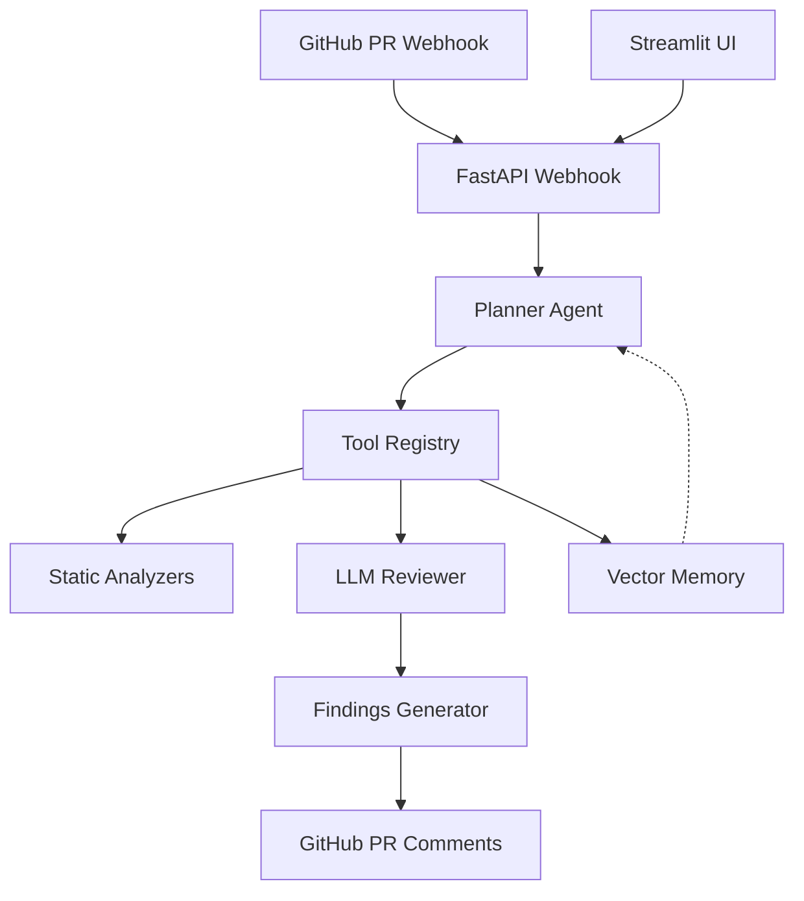

# Sentinel AI — Intelligent Code Security & Quality Agent

[](LICENSE)
[](https://www.python.org)
[](docker-compose.yml)
[](https://github.com/GBOYEE/sentinel-ai/actions)
[](https://codecov.io/gh/GBOYEE/sentinel-ai)

**AI-powered code security and quality agent for GitHub pull requests.** Sentinel scans your diffs with static analysis + LLM reasoning, posts contextual review comments, and suggests fixes — automatically.

<p align="center">
  
</p>

## ✨ Why This Exists

Manual code reviews are slow and inconsistent. Traditional security scanners (SonarQube, Snyk) are noisy and lack context. AI coding assistants write code but don't review it.

Sentinel bridges the gap: **PR-level, AI-native code review** that understands your codebase, catches vulnerabilities and quality issues, and suggests fixes — like a senior dev reviewing every pull request.

## 🎯 Key Features

- 🔒 **Security Scanning** — Detect SQL injection, XSS, auth flaws, path traversal, etc.
- ⚡ **Code Quality** — Identify code smells, complexity, duplication, naming issues
- 🧠 **LLM-Powered Reasoning** — Context-aware findings with natural language explanations
- 🛠️ **Fix Suggestions** — AI generates patches or refactor snippets
- 📊 **Dashboard** — Streamlit UI for configuration, review history, metrics
- 🔗 **GitHub Native** — Posts comments directly on PRs (review API)
- 🐳 **One-Command Deploy** — Docker Compose setup with GitHub App installation
- 📈 **Continuous Learning** — Vector memory stores past findings to improve over time

## 🚀 Quick Start (5 minutes)

### 1. Create a GitHub App
Go to GitHub → Settings → Developer settings → GitHub Apps → New GitHub App:
- Name: `Sentinel AI`
- Webhook URL: `https://your-domain.com/webhook`
- Permissions: Pull requests (Read & Write), Contents (Read), Metadata (Read)
- Subscribe to: Pull request events

Copy the App ID, Private Key, and Webhook secret.

### 2. Deploy Sentinel

```bash
git clone https://github.com/GBOYEE/sentinel-ai.git
cd sentinel-ai
cp .env.example .env
# Edit .env with your GH_APP_ID, GH_APP_PRIVATE_KEY, GH_WEBHOOK_SECRET
docker compose up -d
```

### 3. Install the App
Visit the generated installation URL (or use GitHub App installation flow) and install on your target repositories.

### 4. See the Magic
Open a PR — Sentinel will automatically post a review with findings and suggested fixes.

## 🏗️ Architecture



**Components:**
- **FastAPI webhook receiver** — handles GitHub PR events
- **Planner agent** — orchestrates review steps (static analysis → LLM → aggregate)
- **Static analyzers** — bandit, flake8, semgrep for baseline issues
- **LLM reviewer** — OpenRouter/OpenAI for context-aware review
- **Vector memory** — ChromaDB for learning from past findings
- **PR poster** — Creates GitHub review comments with fix suggestions
- **Streamlit dashboard** — Configure settings, view history, metrics

See [docs/architecture.md](docs/architecture.md) for detailed design.

## 📦 Tech Stack

| Layer | Technology |
|-------|------------|
| Backend | FastAPI, asyncio |
| Agents | OpenClaw-compatible planner/executor |
| LLM | OpenRouter (Claude, GPT-4o) or Ollama (local) |
| Memory | ChromaDB (vector store) |
| Static Analysis | bandit, flake8, semgrep |
| Frontend | Streamlit (dashboard) |
| Deployment | Docker Compose, GitHub App |
| Database | PostgreSQL (optional for multi-tenant) |

## 🧪 Testing & CI

```bash
# Install deps
pip install -e .[dev]

# Run tests
pytest tests/ -v --cov=sentinel_ai

# Lint and type-check
black sentinel_ai/
ruff sentinel_ai/
mypy sentinel_ai/
```

CI runs on every push: lint, type-check, tests, coverage upload.

## 📚 Documentation

- [Getting Started](docs/README.md)
- [GitHub App Setup](docs/github-app-setup.md)
- [Configuration](docs/configuration.md)
- [API Reference](docs/api.md)
- [Contributing](CONTRIBUTING.md)

## 🎯 Roadmap

- [ ] Multi-language support (TypeScript, Go, Rust)
- [ ] Custom rule authoring UI
- [ ] Team settings and RBAC
- [ ] Integration with Jira, Linear, Slack
- [ ] Performance profiling suggestions
- [ ] Auto-fix via PR bot comments (apply patch button)
- [ ] Self-hosted LLM option (no data leaves network)
- [ ] Enterprise SaaS offering

## 🤝 Contributing

We welcome contributors! See [CONTRIBUTING.md](CONTRIBUTING.md). Good first issues:
- Add new static analysis rules
- Improve LLM prompts for specific languages
- Dashboard UI enhancements
- Documentation and examples

## 📄 License

MIT — see [LICENSE](LICENSE).

---

<p align="center">
Built by <a href="https://github.com/GBOYEE">Oyebanji Adegboyega</a> • 
<a href="https://gboyee.github.io">Portfolio</a> • 
<a href="https://twitter.com/Gboyee_0">@Gboyee_0</a>
</p>
