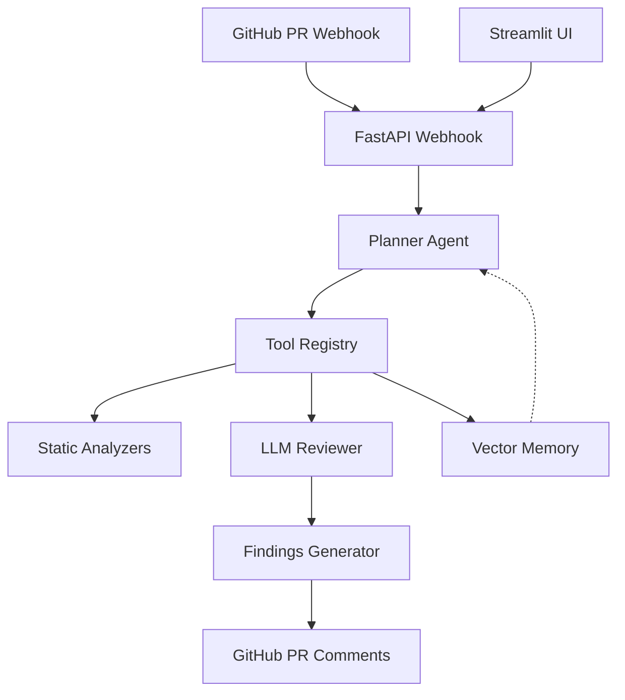

# Sentinel AI — Autonomous PR Security Reviewer

**Production-grade AI agent that reviews GitHub pull requests for security vulnerabilities and code quality issues.** Sentinel combines static analysis (bandit, flake8, semgrep) with LLM reasoning (OpenRouter/Ollama) to post contextual review comments directly on PRs — like a senior security engineer reviewing every change.

<p align="center">
  
</p>

## 🎯 Why This Exists

Manual code reviews are slow and inconsistent. Traditional security scanners (SonarQube, Snyk) are noisy and lack context. AI coding assistants write code but don't review it.

**Sentinel bridges the gap:** AI-native, PR-level code review that understands your codebase, catches vulnerabilities and quality issues, and suggests fixes — automatically.

## ✨ Key Features

- 🔒 **Security-First Review** — Detects SQL injection, XSS, auth flaws, path traversal, and more
- ⚡ **Static Analysis Pipeline** — bandit (security), flake8 (quality), semgrep (patterns)
- 🧠 **LLM-Powered Reasoning** — OpenRouter (Claude/GPT-4o) or Ollama for contextual, natural language explanations
- 🛠️ **Fix Suggestions** — AI generates patches or code snippets to resolve issues
- 📊 **Live Dashboard** — Streamlit UI for configuration, review history, metrics
- 🔗 **GitHub Native** — Posts comments directly on PRs using GitHub Review API
- 🐳 **One-Command Deploy** — Docker Compose with GitHub App integration
- 📈 **Continuous Learning** — Vector memory (ChromaDB) stores past findings to improve over time

## 🚀 Quick Start (5 Minutes)

### 1. Create a GitHub App

1. Go to **GitHub → Settings → Developer settings → GitHub Apps → New GitHub App**
2. Configure:
   - **GitHub App name:** `Sentinel AI`
   - **Webhook URL:** `https://your-domain.com/webhook` (use ngrok for local: `https://<random>.ngrok.io`)
   - **Repository permissions:**
     - Pull requests: **Read & Write**
     - Contents: **Read**
     - Metadata: **Read**
   - **Subscribe to events:** Pull request
3. Generate a **private key** and download it
4. Note the **App ID** and **Webhook secret** (you'll need these)

### 2. Deploy Sentinel

```bash
git clone https://github.com/GBOYEE/sentinel-ai.git
cd sentinel-ai
cp .env.example .env
# Edit .env with:
# GH_APP_ID=<your_app_id>
# GH_WEBHOOK_SECRET=<your_webhook_secret>
# Place private key at secrets/gh_private_key.pem
docker compose up -d
```

### 3. Install the App

Install your GitHub App on the target repository (or organization). Sentinel will automatically start reviewing PRs.

### 4. See the Magic

Open a pull request. Within ~60 seconds, Sentinel posts a review comment with security and quality findings, plus suggested fixes.

<p align="center">
  
</p>

## 🏗️ Architecture



**Components:**
- **FastAPI webhook receiver** — Handles GitHub PR events with signature verification
- **Planner agent** — Orchestrates review steps (static analysis → LLM → aggregate)
- **Static analyzers** — bandit (security), flake8 (quality), semgrep (patterns)
- **LLM reviewer** — OpenRouter or Ollama for context-aware review with fix generation
- **Vector memory** — ChromaDB for learning from past findings
- **PR commenter** — Creates GitHub review comments with severity labels and suggestions
- **Streamlit dashboard** — Configuration, review history, metrics, and settings

See [docs/architecture.md](docs/architecture.md) for detailed design.

## 📦 Tech Stack

| Layer | Technology |
|-------|------------|
| Backend | FastAPI, asyncio |
| Agents | OpenClaw-compatible planner/executor |
| LLM | OpenRouter (Claude, GPT-4o) or Ollama (local) |
| Memory | ChromaDB (vector store) |
| Static Analysis | bandit, flake8, semgrep |
| Frontend | Streamlit (dashboard) |
| Deployment | Docker Compose, GitHub App |
| Database | PostgreSQL (optional for multi-tenant) |
| Cache | Redis (optional) |

## 🧪 Testing & CI

```bash
# Install deps
pip install -r requirements.txt

# Run tests
pytest tests/ -v --cov=sentinel_ai

# Lint and type-check
ruff sentinel_ai/
mypy sentinel_ai/
```

CI runs on every push: lint, type-check, tests, coverage upload.

## 📚 Documentation

- [Getting Started](docs/README.md) — Full setup walkthrough
- [GitHub App Setup](docs/github-app-setup.md) — Detailed App creation steps
- [Configuration](docs/configuration.md) — All environment variables
- [API Reference](docs/api.md) — Webhook and internal endpoints
- [Contributing](CONTRIBUTING.md) — We welcome contributors!

## 🎯 Roadmap

- [ ] Multi-language support (TypeScript, Go, Rust)
- [ ] Custom rule authoring UI
- [ ] Team settings and RBAC
- [ ] Integration with Jira, Linear, Slack
- [ ] Performance profiling suggestions
- [ ] Auto-fix via PR bot comments (apply patch button)
- [ ] Self-hosted LLM option (no data leaves network)
- [ ] Enterprise SaaS offering
- [ ] SCM integrations (GitLab, Bitbucket)

## 🤝 Contributing

We welcome contributors! See [CONTRIBUTING.md](CONTRIBUTING.md). Good first issues:
- Add new static analysis rules
- Improve LLM prompts for specific languages
- Dashboard UI enhancements
- Documentation and examples

## 📄 License

MIT — see [LICENSE](LICENSE).

---

<p align="center">
Built by <a href="https://github.com/GBOYEE">Oyebanji Adegboyega</a> • 
<a href="https://gboyee.github.io">Portfolio</a> • 
<a href="https://twitter.com/Gboyee_0">@Gboyee_0</a>
</p>

---

**Positioning:** *"Autonomous AI security reviewer for GitHub PRs — catch vulnerabilities before they ship."*
