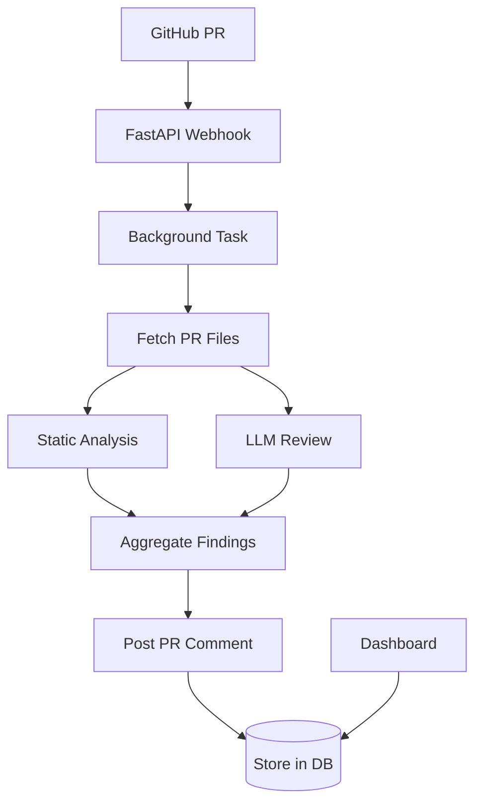

# Architecture

## Overview

Sentinel AI is a GitHub App that performs automated code reviews on pull requests. It combines static analysis tools (bandit, flake8) with LLM reasoning to detect security vulnerabilities, code quality issues, and best practices violations.

## Components

- **Webhook Receiver (FastAPI)** — Handles GitHub PR events securely
- **Auth (JWT)** — GitHub App authentication for API calls
- **Static Analyzers** — bandit (security), flake8 (quality), semgrep (patterns)
- **LLM Reviewer** — OpenRouter or Ollama for context-aware analysis
- **PR Commenter** — Posts findings as GitHub review comments
- **Dashboard (Streamlit)** — Configuration, history, metrics

## Flow

1. GitHub sends `pull_request` webhook to `/webhook`
2. FastAPI validates signature, queues background task
3. Background task:
   - Fetches PR files via GitHub API
   - For each changed file:
     - Run static analyzers (if Python)
     - Run LLM review with code context
   - Aggregate findings
   - Post review comment on PR
4. Dashboard reads from database (future) or logs for metrics

## Extensibility

- Add new scanners in `scanners.py`
- Customize LLM prompts in `llm_reviewer.py`
- Add more GitHub event types (issues, pushes)
- Store findings in PostgreSQL for history
- Add team settings and RBAC

## Data Flow

